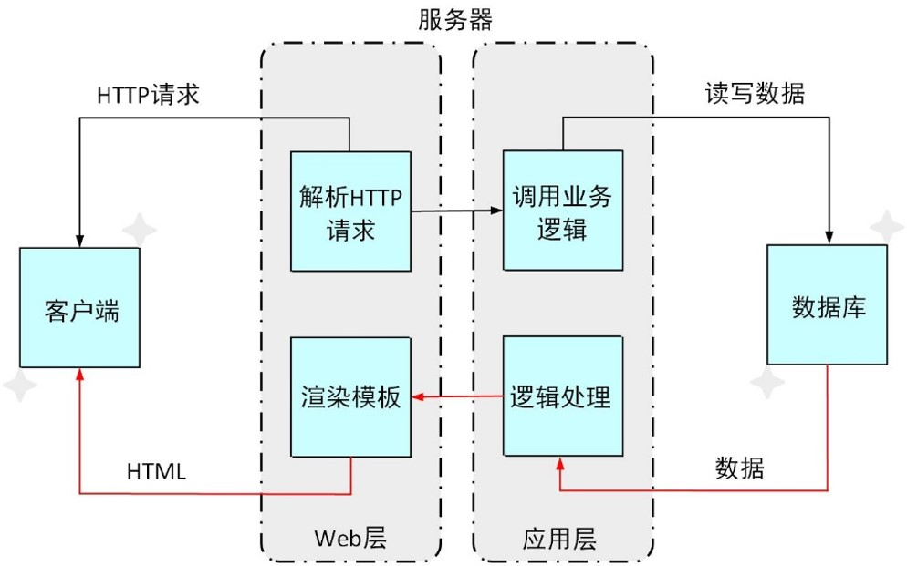
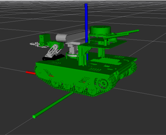
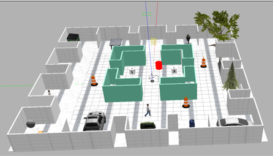
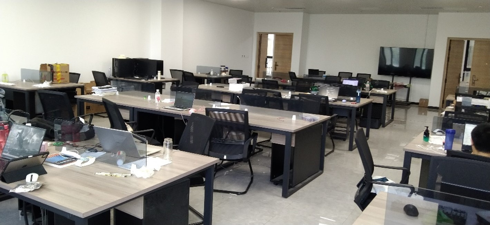
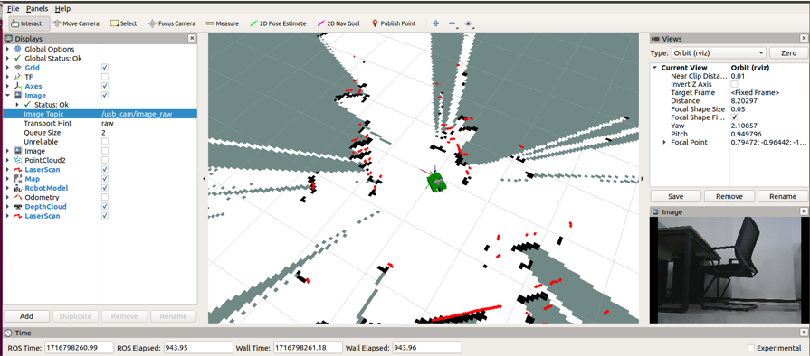
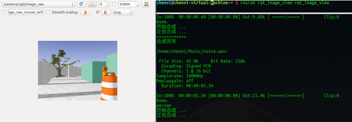
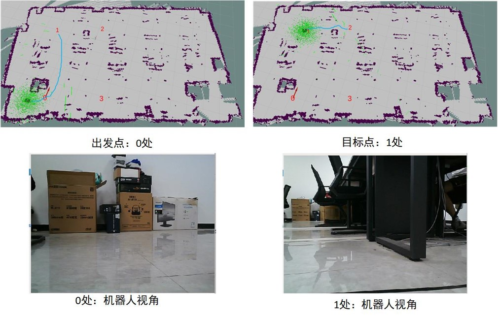
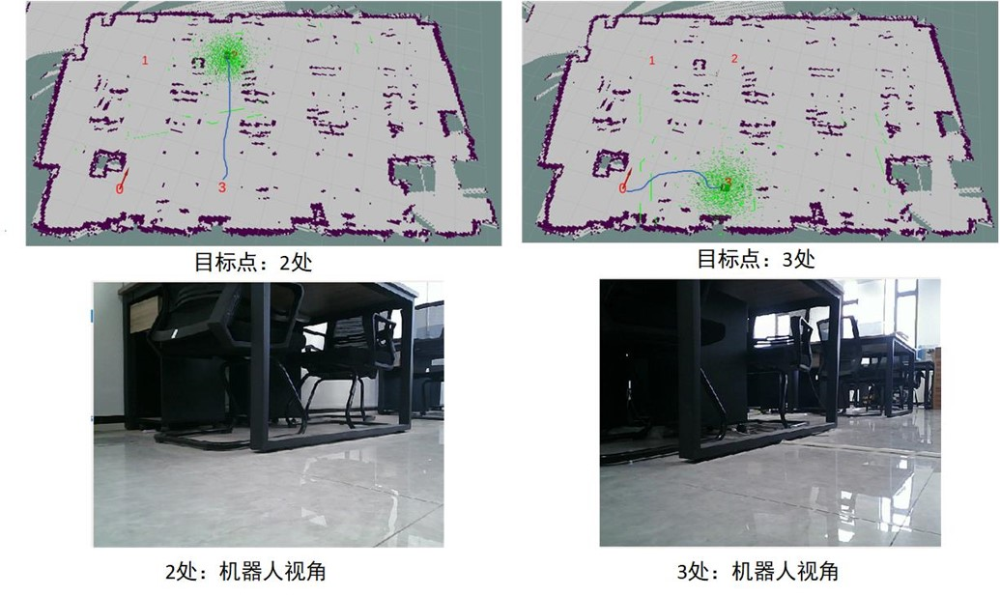

<div align="center">

# 🤖 Archer 自主导航与自动巡检系统

ROS 2 Humble · Gazebo Classic · Nav2

仓库仿真 ｜ SLAM 建图 ｜ 自主导航 ｜ 多点巡检 ｜ 拍照与语音播报

</div>

## 🚀 快速开始

环境：Ubuntu 22.04、ROS 2 Humble、Gazebo Classic。准备好 `colcon`、已初始化的 `rosdep` 后编译：

```bash
git clone https://github.com/showarcher/ros2_partol_robot.git
cd ros2_partol_robot
source /opt/ros/humble/setup.bash
rosdep install --from-paths src --ignore-src --rosdistro humble -r -y
colcon build --symlink-install
source install/setup.bash
```

启动仓库仿真与导航：

```bash
ros2 launch robot_rl_navigation2 navigation2.launch.py
```

等待控制器与 Nav2 就绪后，在 RViz 中使用 **Nav2 Goal** 设置目标；需要校准定位时使用 **2D Pose Estimate**。每个新终端都先加载 ROS 2 和本工作区的 `install/setup.bash`。

## 🧭 常用操作

```bash
# 自动巡检：另开终端，保持导航运行
ros2 launch autopatrol_robot autopatrol.launch.py

# 切换原房间：先关闭上一套仿真
ros2 launch robot_rl_navigation2 navigation2.launch.py scene:=room

# 仓库 SLAM 建图
ros2 launch robot_rl_navigation2 navigation2.launch.py slam:=true

# 建图时，在另一终端使用键盘控制
ros2 run teleop_twist_keyboard teleop_twist_keyboard
```

巡检语音需要 `espeak-ng` 和 Python 包 `espeakng==1.0.3`。仓库路线见 [巡检配置](src/autopatrol_robot/config/warehouse_patrol.yaml)，照片保存到 `/tmp/autopatrol_warehouse_images`。原房间巡检需加 `scene:=room`。

使用自己的场景和地图：

```bash
ros2 launch robot_rl_navigation2 navigation2.launch.py \
  world:=/绝对路径/my_world.world map:=/绝对路径/my_map.yaml localization:=amcl
```

世界与地图应配套。更多操作见 [使用指南](docs/WORKSPACE_GUIDE.md) 和 [地图说明](src/robot_rl_navigation2/maps/README.md)。

## 📷 实验过程与展示

以下为早期 ROS 1 实验资料，记录系统架构、环境搭建、建图和导航过程。

<table>
  <tr>
    <td width="50%" align="center"><b>B/S 架构</b><br><br>客户端、服务端业务逻辑与数据库交互流程。</td>
    <td width="50%" align="center"><b>机器人模型</b><br><br>履带式机器人及传感器的模型展示。</td>
  </tr>
  <tr>
    <td align="center"><b>仿真环境</b><br><br>包含房间、通道与障碍物的仿真场景。</td>
    <td align="center"><b>实际测试环境</b><br><br>用于实地测试的室内桌椅与通道布局。</td>
  </tr>
  <tr>
    <td align="center"><b>SLAM 建图</b><br><br>RViz 中的栅格地图、激光扫描和相机画面。</td>
    <td align="center"><b>检测与合成</b><br><br>相机观测画面与语音合成运行记录。</td>
  </tr>
  <tr>
    <td align="center"><b>实验结果展示</b><br><br>出发点与目标点 1 的导航路径、定位及机器人视角。</td>
    <td align="center"><b>实验结果展示 2</b><br><br>目标点 2、3 的导航路径、定位及机器人视角。</td>
  </tr>
</table>

[当前 ROS 2 仓库测试记录](docs/WAREHOUSE_TEST_REPORT.md) · [第三方资源与许可](docs/third_party/README.md)
