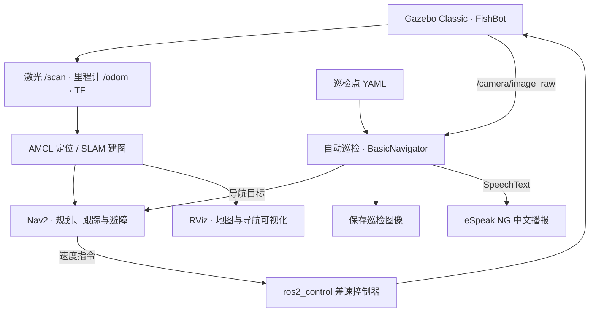

<div align="center">

# 🤖 ROS 2 Autonomous Patrol Robot

### FishBot 自主导航与自动巡检系统

基于 ROS 2 Humble · Gazebo Classic · Nav2 的移动机器人仿真工作区


**仿真搭建 → SLAM 建图 → 自主导航 → 多点巡检 → 图像记录与语音播报**

[快速开始](#-快速开始) · [系统架构](#-系统架构) · [自动巡检](#-自动巡检) · [详细指南](docs/WORKSPACE_GUIDE.md)

</div>

---

## ✨ 项目亮点

| 能力 | 实现 |
| :--- | :--- |
| 🤖 FishBot 仿真 | URDF/Xacro 模型、差速控制器、激光雷达和彩色/深度相机 |
| 🧭 自主导航 | AMCL 定位、SmacPlanner2D 全局规划、Regulated Pure Pursuit 路径跟踪 |
| 🗺️ SLAM 建图 | 通过 `slam:=true` 切换建图模式，保存地图后用于导航 |
| 🔁 自动巡检 | 按 YAML 配置循环访问目标点，导航失败时跳过该点 |
| 📷 到点记录 | 保存 `/camera/image_raw` 图像，以机器人位置命名 |
| 🔊 中文播报 | 通过自定义 `SpeechText` 服务调用 eSpeak NG |
| 🏠 多场景探索 | 随仓库提供 PAL 世界、模型与网格，可切换不同室内环境 |
| 🚀 统一启动 | 一条 launch 命令启动 Gazebo、机器人、Nav2 与 RViz；支持无 GUI |

## 🏗️ 系统架构



## 📦 工作区结构

```text
ros2_partol_robot/
├── src/
│   ├── robot_rl_description/     # FishBot 模型、控制器、Gazebo 世界与资源
│   ├── robot_rl_navigation2/     # Nav2 参数、地图、RViz 与统一启动入口
│   ├── robot_rl_application/     # 位姿查询、单点导航与路点跟随示例
│   ├── autopatrol_interfaces/    # SpeechText.srv 语音服务接口
│   └── autopatrol_robot/         # 循环巡检、拍照与语音节点
├── scripts/                     # 本机工作区辅助脚本
├── docs/WORKSPACE_GUIDE.md       # 完整操作指南与 PAL home.world 建图示例
└── NAV2_MAP_TF_CAMERA_FIX_REPORT.md
```

> 仓库已采用完整 colcon 工作区布局。请在仓库根目录编译；旧版本根目录下的 `fishbot_*` / `autopartol_*` 包已由 `src/` 中的当前版本替代。

## 🚀 快速开始

### 1. 准备环境

目标环境为 **Ubuntu 22.04 + ROS 2 Humble + Gazebo Classic**。先安装 ROS 2 Humble，并确保 `rosdep` 已初始化，然后执行：

```bash
git clone https://github.com/showarcher/ros2_partol_robot.git
cd ros2_partol_robot
source /opt/ros/humble/setup.bash

sudo apt update
sudo apt install python3-colcon-common-extensions python3-rosdep \
  python3-pip espeak-ng ros-humble-teleop-twist-keyboard
rosdep install --from-paths src --ignore-src --rosdistro humble -r -y
python3 -m pip install espeakng==1.0.3
```

### 2. 编译工作区

```bash
colcon build --symlink-install
source install/setup.bash
```

每个新终端都需要加载 `/opt/ros/humble/setup.bash` 和本仓库的 `install/setup.bash`。
`scripts/build_workspace.sh` 是原开发环境的辅助脚本，要求同级 `robot_rl` 工作区；独立克隆请使用上面的编译命令。

### 3. 启动仿真导航

```bash
ros2 launch robot_rl_navigation2 navigation2.launch.py
```

默认载入 `custom_room.world` 与配套 `room.yaml`，启动 Gazebo、FishBot、控制器、Nav2 和 RViz。Nav2 默认延迟 8 秒、RViz 延迟 15 秒启动；仍需等待节点激活后再操作。

在 RViz 中使用 **Nav2 Goal** 设置目标。若更换出生位置或地图，先使用 **2D Pose Estimate** 对齐定位，确认激光与地图墙壁重合。

<details>
<summary><b>常用启动选项</b></summary>

```bash
# 无图形界面
ros2 launch robot_rl_navigation2 navigation2.launch.py gui:=false use_rviz:=false

# 复用已经启动的 Gazebo
ros2 launch robot_rl_navigation2 navigation2.launch.py start_gazebo:=false

# 仅运行机器人仿真
ros2 launch robot_rl_description gazebo_sim.launch.py

# 仅在 RViz 展示机器人模型
ros2 launch robot_rl_description display_robot.launch.py
```

| 参数 | 默认值 | 用途 |
| :--- | :--- | :--- |
| `slam` | `false` | 切换 SLAM 建图模式 |
| `world` / `map` | 内置房间与地图 | 选择对应场景和地图的绝对路径 |
| `nav2_params_file` | 内置 Nav2 配置 | 使用自定义导航参数 |
| `spawn_x` / `spawn_y` / `spawn_yaw` | `0.0` | 设置生成位置与朝向 |
| `nav2_delay` / `rviz_delay` | `8.0` / `15.0` | 调整启动等待时间，单位秒 |

</details>

## 🔁 自动巡检

保持仿真导航运行，在另一个已加载环境的终端启动：

```bash
ros2 launch autopatrol_robot autopatrol.launch.py
```

巡检流程：**语音服务就绪 → 初始化定位 → 读取目标点 → 导航 → 到点拍照与播报 → 下一个目标 → 循环**。

配置文件：[patrol_config.yaml](src/autopatrol_robot/config/patrol_config.yaml)。`initial_point` 和每组 `target_points` 均为 `[x, y, yaw]`，距离单位为米，角度单位为弧度。当前配置包含 5 个目标点；使用前应检查它们是否位于当前地图的可通行区域。

图像默认保存到 `/tmp/autopatrol_images`。节点仅在已收到相机图像时保存；同一位置的文件名可能重复覆盖，需要长期保存时请调整目录与命名方式。

## 🗺️ 在新场景中建图

```bash
# 终端 1：启动 PAL home 世界并建图
PAL_WORLD="$(ros2 pkg prefix robot_rl_description)/share/robot_rl_description/world/pal"
ros2 launch robot_rl_navigation2 navigation2.launch.py \
  world:="$PAL_WORLD/home.world" slam:=true spawn_z:=0.15

# 终端 2：键盘控制，缓慢遍历场景
ros2 run teleop_twist_keyboard teleop_twist_keyboard

# 终端 3：在仓库根目录保存地图
ros2 run nav2_map_server map_saver_cli \
  -f "$PWD/src/robot_rl_navigation2/maps/pal_home"
```

保存完成后停止 SLAM，重新编译地图包，再使用保存的地图导航：

```bash
colcon build --symlink-install --packages-select robot_rl_navigation2
source install/setup.bash
PAL_WORLD="$(ros2 pkg prefix robot_rl_description)/share/robot_rl_description/world/pal"
NAV_MAP="$(ros2 pkg prefix robot_rl_navigation2)/share/robot_rl_navigation2/maps"
ros2 launch robot_rl_navigation2 navigation2.launch.py \
  world:="$PAL_WORLD/home.world" map:="$NAV_MAP/pal_home.yaml" spawn_z:=0.15
```

世界与地图必须匹配；地图原点不一定等于 Gazebo 世界原点，重新启动后请校准初始位姿。完整步骤见 [PAL 场景与建图指南](docs/WORKSPACE_GUIDE.md)。

## 📡 关键接口

| 名称 | 类型 / 作用 |
| :--- | :--- |
| `/scan` | `sensor_msgs/LaserScan` · 激光数据 |
| `/odom` | `nav_msgs/Odometry` · 里程计 |
| `/map` | `nav_msgs/OccupancyGrid` · 占据栅格地图 |
| `/camera/image_raw` | `sensor_msgs/Image` · 巡检彩色图像 |
| `/camera/depth/image_raw` | `sensor_msgs/Image` · 深度图像 |
| `/cmd_vel` | `geometry_msgs/Twist` · 机器人速度指令 |
| `/navigate_to_pose` | `nav2_msgs/action/NavigateToPose` · 导航动作 |
| `/speech_text` | `autopatrol_interfaces/srv/SpeechText` · 语音服务 |

## 🔧 排查与使用边界

- **旧 Gazebo 占用端口**：关闭先前的 launch/gzserver；需要复用时设置 `start_gazebo:=false`。
- **地图或 TF 不正常**：检查 `/scan`、`/clock` 与控制器状态，并确认世界和地图匹配。
- **无桌面环境**：设置 `gui:=false use_rviz:=false`；相机渲染仍依赖可用的图形环境。
- **语音或图像缺失**：检查 `espeakng`、系统音频设备、语音服务与相机话题。
- **PAL 资源缺失**：部分上游场景包含缺失模型或原开发机绝对路径，详见操作指南。
- **基础导航示例**：`robot_rl_application` 中的导航坐标写在源码中，尚无通用坐标命令行参数。

```bash
ros2 control list_controllers
ros2 lifecycle nodes
ros2 topic hz /scan
ros2 interface show autopatrol_interfaces/srv/SpeechText
```

## 📚 文档与致谢

- [完整工作区操作指南](docs/WORKSPACE_GUIDE.md)
- [机器人模型与仿真](src/robot_rl_description/README.md)
- [Nav2 使用说明](src/robot_rl_navigation2/README.md)
- [地图说明](src/robot_rl_navigation2/maps/README.md)
- [地图、TF 与相机修复记录](NAV2_MAP_TF_CAMERA_FIX_REPORT.md)

项目使用 ROS 2、Nav2、Gazebo 与 PAL 场景资源。README 的章节组织参考了 [Sara-Esm 的自主仓库导航项目](https://github.com/Sara-Esm/ros2-autonomous-warehouse-navigation)。各源码包和第三方资源的许可声明请查阅对应文件；部分包的许可字段仍待完善。

<div align="center">

Maintained by [@showarcher](https://github.com/showarcher)

</div>
